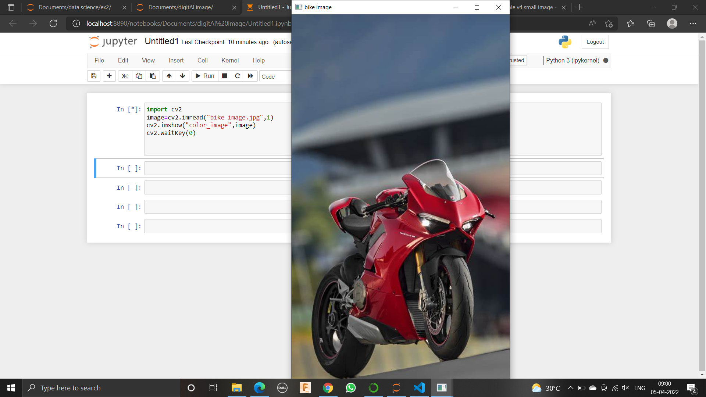
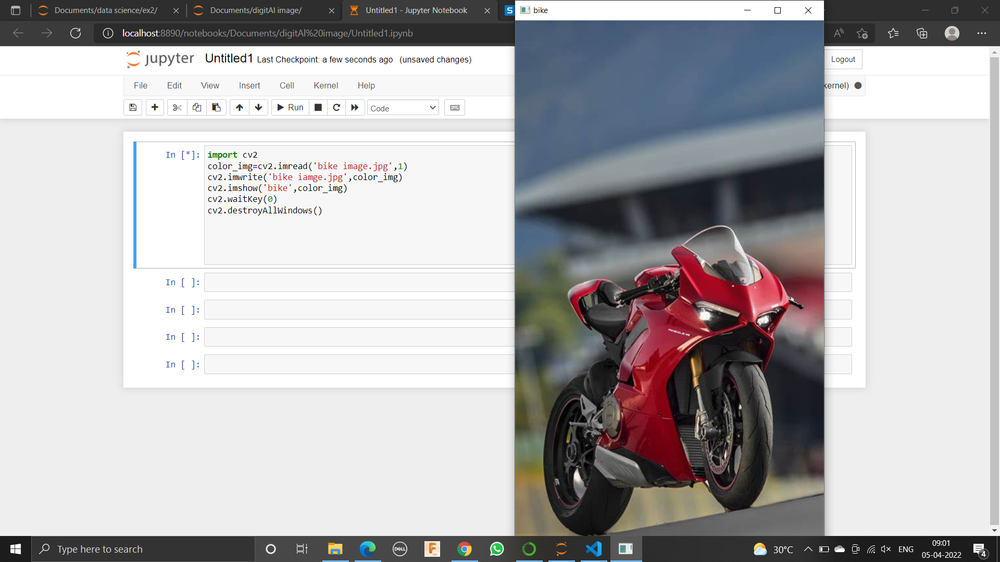
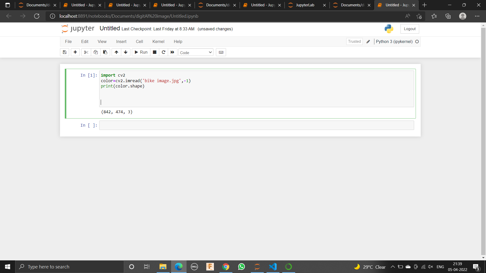
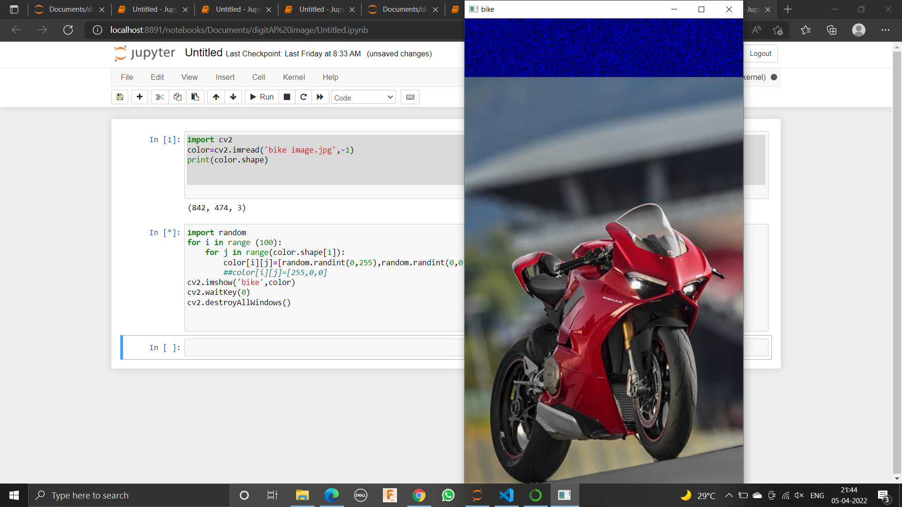
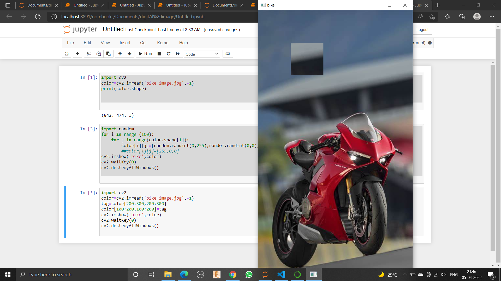

# READ AND WRITE AN IMAGE
## AIM
To write a python program using OpenCV to do the following image manipulations.
i) Read, display, and write an image.
ii) Access the rows and columns in an image.
iii) Cut and paste a small portion of the image.

## Software Required:
Anaconda - Python 3.7
## Algorithm:
### Step1:
Choose an image and save it as a filename.jpg
### Step2:
Use imread(filename, flags) to read the file.
### Step3:
Use imshow(window_name, image) to display the image.
### Step4:
Use imwrite(filename, image) to write the image.
### Step5:
End the program and close the output image windows.
## Program:
### Developed By:MS.JEEVA
### Register Number: 212221230040
i) #To Read,display the image
```
import cv2
image=cv2.imread("bike image.jpg",1)
cv2.imshow("color_image",image)
cv2.waitKey(0)

```
ii) #To write the image
```
import cv2
color_img=cv2.imread('bike image.jpg',1)
cv2.imwrite('bike iamge.jpg',color_img)
cv2.imshow('bike',color_img)
cv2.waitKey(0)
cv2.destroyAllWindows()


```
iii) #Find the shape of the Image
```
import cv2
color=cv2.imread('bike image.jpg',-1)
print(color.shape)


```
iv) #To access rows and columns

```
import random
for i in range (100):
    for j in range(color.shape[1]):
        color[i][j]=[random.randint(0,255),random.randint(0,0),random.randint(0,0)]
        ##color[i][j]=[255,0,0]
cv2.imshow('bike',color)
cv2.waitKey(0)
cv2.destroyAllWindows()


```
v) #To cut and paste portion of image
```
import cv2
color=cv2.imread('bike image.jpg',-1)
tag=color[200:300,200:300]
color[100:200,100:200]=tag
cv2.imshow('bike',color)
cv2.waitKey(0)
cv2.destroyAllWindows()


```

## Output:

 i) Read and display the image

 


### ii)Write the image


<br>
<br>

### iii)Shape of the Image


<br>
<br>

### iv)Access rows and columns


<br>
<br>

### v)Cut and paste portion of image

<br>
<br>

## Result:
Thus the images are read, displayed, and written successfully using the python program.


